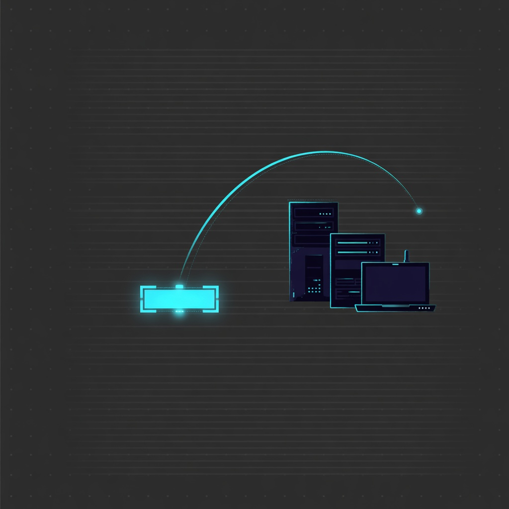
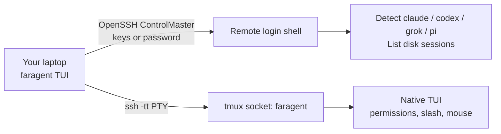

<p align="center">
  
</p>

<h1 align="center">FarAgent</h1>

<p align="center"><strong>English</strong> · <a href="README.zh-CN.md">中文</a></p>

<p align="center">
  <strong>Your coding agents on any machine you can SSH into —<br>including the ones you can't install anything on.</strong><br>
  CLI: <code>faragent</code>
</p>

<p align="center">
  <a href="#quick-start">Quick start</a> ·
  <a href="#why-not-just-tmux">Why not just tmux</a> ·
  <a href="docs/README.md">Docs</a> ·
  <a href="docs/en/user-guide.md">User guide</a> ·
  <a href="docs/en/development.md">Developers</a>
</p>

<p align="center">
  
  
  
  
  
  
</p>

---

**FarAgent** (`faragent`) attaches your terminal to Claude Code, Codex, Grok Build, and Pi **already installed on your own machines** — over plain OpenSSH. Inference stays on the remote host. It is not a new coding agent, not a cloud IDE, not a local-key tunnel, and not another terminal multiplexer. (Formerly FarSSH.)

Three things it does that most tools in this space don't:

- **Nothing of ours is installed on the host.** No faragent binary, no daemon, no Python. The remote runs `bash`, `find`, and `tmux`; a `~/.faragent/tmux.conf` is piped in on first start. That is the whole footprint.
- **Native Windows 11 remotes.** Win32 OpenSSH with the default cmd shell, no WSL — a Windows machine is a first-class host, not a WSL workaround.
- **The remote stays yours.** The model, the files, the MCP servers, and the API keys never leave it. Closing the laptop does not kill the agent: it keeps running in tmux, and you attach the same pane later.

## Why

| You already… | Without faragent | With faragent |
| --- | --- | --- |
| `ssh devbox` then remember `tmux attach` | Fragile, easy to start a second Codex/Claude on the same repo | Host → agent → session, **live attaches only** |
| Pay for Claude / ChatGPT / Grok on the home machine | Copying keys to a café laptop is a bad idea | Keys never leave the remote |
| Want the native TUI (slash commands, mouse, permissions) | Official desktop remote apps are one-vendor | Claude Code, Codex, Grok Build, and Pi in one picker |
| Point at a box you are not allowed to install things on | Other tools want a runtime, a daemon, or Node on that host | The host gets a `tmux.conf` and nothing else |
| Remote into a Windows 11 machine | Almost everything here is macOS/Linux only | Win32 OpenSSH, no WSL ([keep-alive still on the roadmap](docs/en/roadmap.md)) |

## Why not just tmux?

tmux is not the thing FarAgent replaces — it is the thing FarAgent drives. All of the rows below are about the layer *around* tmux.

| | plain `ssh` + tmux | faragent |
| --- | --- | --- |
| Finding the session again | `tmux attach`, then hunt for the pane | Host → agent → session, with `[live]` and `[idle]` rows |
| Starting a second agent on one repo | Easy to do by accident | Live sessions **attach only** ([why](https://github.com/openai/codex/issues/30424)) |
| A fresh box | Install tmux and the agent by hand | Told what is missing, official installer, one confirm screen |
| A Windows 11 remote | No tmux to attach to | Supported in resume mode |
| A connection that fails | Raw ssh output | Verbatim output, the likely cause, and a copy-paste fix |

## How it works



1. Pick a `Host` from `~/.ssh/config` (concrete names only; `*` wildcards are ignored).
2. Probe the remote **login shell** so nvm / Homebrew / `~/.local/bin` still work.
3. Pick an agent and a session, or start a new one in a remote directory.
4. `faragent` creates or reuses a tmux session on an isolated socket named `faragent` (your personal tmux server is untouched).
5. Your terminal becomes the remote agent. Detach with **`Ctrl-g d`**. Reattach later; do not `resume` a live process.

## Features

- **Four agents, one picker** — Claude Code, Codex, Grok Build, Pi; missing ones show as `not installed · enter to install`.
- **Native vibe coding** — not a reimplemented chat UI. Slash commands, diffs, and permission prompts are the agent’s own.
- **Session list** — idle transcripts from disk plus **live** tmux panes.
- **Safe reconnect** — live sessions only attach, so you do not get two Codex agents rewriting the same tree ([openai/codex#30424](https://github.com/openai/codex/issues/30424)).
- **Remote stays yours** — official installers run on the host after you confirm the commands; API keys stay remote; protocol servers bind nowhere; traffic is SSH.
- **Install / upgrade / uninstall** — confirm screen lists every command, then `ssh -tt` streams the process. Agent CLIs: official `curl | bash`, user directory, no sudo. tmux/curl may use sudo + brew/apt/dnf/yum/pacman/apk.
- **Fixes, not riddles** — a failed connection shows the verbatim ssh output, the likely cause, and copy-pasteable commands (press `y` to copy the whole report). See the [error table](docs/en/ssh-access.md#when-it-fails-error-cause-fix).
- **Keys or passwords** — key/agent login by default; when the server only accepts a password, log in once interactively and FarAgent reuses the multiplexed connection. The password goes straight to OpenSSH, never stored.
- **Doctor** — `faragent doctor --host devbox` prints PATH, tmux, and agent versions.

```
┌ FarAgent · home-mac · Grok Build ──────────────────────────┐
│ sessions  [live]=tmux still running                          │
│ ▸ [live]  SSH passthrough TUI   (/Users/you/code/app)        │
│   [idle]  Fix flaky tests       (/Users/you/code/app)        │
│   [idle]  (no sessions — press n to start one)               │
├──────────────────────────────────────────────────────────────┤
│ enter attach/resume · n new · r refresh · q back             │
│ agent detach: C-g d                                          │
└──────────────────────────────────────────────────────────────┘
```

## Quick start

**Laptop:** macOS, Linux, or Windows 11, with OpenSSH, and a working path to the host — key-based login (no password prompt), or a password you type once (`faragent login` on macOS/Linux; on Windows the in-memory password prompt — see [SSH access](docs/en/ssh-access.md#windows-client-notes)).

**Remote:** `sshd` and `bash` on Linux/macOS (including WSL2), or Win32 OpenSSH on **native Windows 11** — always with the default cmd shell, key login recommended. `tmux` and agents can be installed from the TUI if missing (on Windows, agents install via their official PowerShell installers; there is no tmux). No python3.

```bash
git clone https://github.com/mahingbun-dev/FarAgent.git
cd FarAgent
cargo install --path crates/faragent-cli
```

```ssh-config
# ~/.ssh/config  — wildcards like Host * are ignored by the picker
# HostName: LAN IP, public IP, domain, or Tailscale 100.x / MagicDNS
Host home-mac
    HostName 192.168.1.8
    User you
    IdentityFile ~/.ssh/id_ed25519
```

```bash
ssh home-mac true          # the key path must work with zero prompts (first run asks for the host key)
faragent doctor --host home-mac
faragent                 # TUI: host → agent → session
```

Inside the agent TUI on a Linux/macOS remote, detach with **`Ctrl-g` then `d`** — the process keeps running on the remote. On a native Windows remote the agent runs in the foreground of the connection: quitting it (or closing the connection) ends it, and the next `enter` restores the conversation through `resume`.

Host that only accepts a password: `faragent auth --host home-mac --mode password`, then `faragent login --host home-mac` (or press `g` in the TUI host list / `a` on the error screen). On Windows the TUI asks for the password itself and keeps it in memory for this run only.

Full walkthrough: [User guide](docs/en/user-guide.md) (developer mode, release binary, copying the binary to another computer). Reaching a machine behind NAT: [SSH access](docs/en/ssh-access.md) (LAN, public IP, domain, Tailscale).

## Documentation

| Topic | English | 中文 |
| --- | --- | --- |
| Docs hub | [docs/](docs/README.md) | [docs/zh/](docs/zh/README.md) |
| Product | [README](README.md) | [README.zh-CN.md](README.zh-CN.md) |
| Using FarAgent | [User guide](docs/en/user-guide.md) | [用户手册](docs/zh/user-guide.md) |
| SSH (LAN / public IP / domain / Tailscale) | [SSH access](docs/en/ssh-access.md) | [SSH 连接](docs/zh/ssh-access.md) |
| Architecture | [Development](docs/en/development.md) | [开发者文档](docs/zh/development.md) |
| Contributing | [Contributing](docs/en/contributing.md) | [参与贡献](docs/zh/contributing.md) |
| Security | [Security](docs/en/security.md) | [安全说明](docs/zh/security.md) |
| Roadmap | [Roadmap](docs/en/roadmap.md) | [后续计划](docs/zh/roadmap.md) |

## Status

v0.2 adds **native Windows 11 support (no WSL)** — as a client and as a remote host in resume mode. Next: a **Windows session host** (tmux-equivalent persistence without WSL) and a **styled app frontend**. Details: [Roadmap](docs/en/roadmap.md).

Password / keyboard-interactive login ships (see [SSH access](docs/en/ssh-access.md#password-only-servers-optional)). Not in the current plan: an OpenClaw-style gateway, compiling tmux from source.

## License

[MIT](LICENSE)
