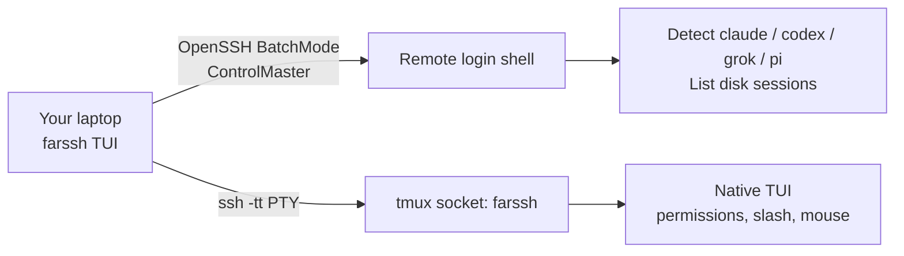

<p align="center">
  
</p>

<h1 align="center">FarSSH</h1>

<p align="center"><strong>English</strong> · <a href="README.zh-CN.md">中文</a></p>

<p align="center">
  <strong>Coding agents on machines far from you — native TUI, over SSH.</strong><br>
  CLI: <code>farssh</code>
</p>

<p align="center">
  <a href="#quick-start">Quick start</a> ·
  <a href="docs/README.md">Docs</a> ·
  <a href="docs/en/user-guide.md">User guide</a> ·
  <a href="docs/en/development.md">Developers</a>
</p>

<p align="center">
  
  
  
  
</p>

---

**FarSSH** (`farssh`) attaches your terminal to Claude Code, Codex, Grok Build, and Pi **already installed on your own machines**. It is not another mux like Herdr/ccmux, and not a local-key tunnel: inference stays on the remote host.

The model, the files, the MCP servers, and the API keys stay on the remote host. Closing the laptop does not kill the agent: it keeps running in tmux. Open `farssh` later and attach the same pane.

## Why

| You already… | Without farssh | With farssh |
| --- | --- | --- |
| `ssh devbox` then remember `tmux attach` | Fragile, easy to start a second Codex/Claude on the same repo | Host → agent → session, **live attaches only** |
| Pay for Claude / ChatGPT / Grok on the home machine | Copying keys to a café laptop is a bad idea | Keys never leave the remote |
| Want the native TUI (slash commands, mouse, permissions) | Official desktop remote apps are one-vendor | Claude Code, Codex, Grok Build, and Pi in one picker |

It is not a new coding agent, not a cloud IDE, and not a gateway you install on every box.

## How it works



1. Pick a `Host` from `~/.ssh/config` (concrete names only; `*` wildcards are ignored).
2. Probe the remote **login shell** so nvm / Homebrew / `~/.local/bin` still work.
3. Pick an agent and a session, or start a new one in a remote directory.
4. `farssh` creates or reuses a tmux session on an isolated socket named `farssh` (your personal tmux server is untouched).
5. Your terminal becomes the remote agent. Detach with **`Ctrl-g d`**. Reattach later; do not `resume` a live process.

## Features

- **Four agents, one picker** — Claude Code, Codex, Grok Build, Pi; missing ones show as `not installed` plus version when present.
- **Native vibe coding** — not a reimplemented chat UI. Slash commands, diffs, and permission prompts are the agent’s own.
- **Session list** — idle transcripts from disk plus **live** tmux panes.
- **Safe reconnect** — live sessions only attach, so you do not get two Codex agents rewriting the same tree ([openai/codex#30424](https://github.com/openai/codex/issues/30424)).
- **Remote stays yours** — no package installs on the host, no API keys copied locally, protocol servers bind nowhere; traffic is SSH.
- **Doctor** — `farssh doctor --host devbox` prints PATH, tmux, and agent versions.

```
┌ FarSSH · home-mac · Grok Build ──────────────────────────┐
│ sessions  [live]=tmux still running                          │
│ ▸ [live]  SSH passthrough TUI   (/Users/you/code/app)        │
│   [idle]  Fix flaky tests       (/Users/you/code/app)        │
│   [idle]  (no sessions — press n to start one)               │
├──────────────────────────────────────────────────────────────┤
│ enter attach/resume · n new · r refresh · q back             │
│ agent detach: C-g d                                          │
└──────────────────────────────────────────────────────────────┘
```

## Quick start

**Laptop:** macOS or Linux, OpenSSH, key-based login to the host (`BatchMode`, no password prompt).

**Remote:** `sshd`, `bash`, `tmux`, and at least one agent already logged in. No python3. Windows hosts: SSH into **WSL2**, not Win32 OpenSSH.

```bash
git clone https://github.com/mahingbun-dev/FarSSH.git
cd FarSSH
cargo install --path .
```

```ssh-config
# ~/.ssh/config  — wildcards like Host * are ignored by the picker
Host home-mac
    HostName 192.168.1.8
    User you
    IdentityFile ~/.ssh/id_ed25519
```

```bash
ssh home-mac true          # must work without a password
farssh doctor --host home-mac
farssh                 # TUI: host → agent → session
```

Inside the agent TUI, detach with **`Ctrl-g` then `d`**. The process keeps running on the remote.

Full walkthrough: [User guide](docs/en/user-guide.md) (developer mode, release binary, copying the binary to another computer).

## Documentation

| Topic | English | 中文 |
| --- | --- | --- |
| Docs hub | [docs/](docs/README.md) | [docs/zh/](docs/zh/README.md) |
| Product | [README](README.md) | [README.zh-CN.md](README.zh-CN.md) |
| Using FarSSH | [User guide](docs/en/user-guide.md) | [用户手册](docs/zh/user-guide.md) |
| Architecture | [Development](docs/en/development.md) | [开发者文档](docs/zh/development.md) |
| Contributing | [Contributing](docs/en/contributing.md) | [参与贡献](docs/zh/contributing.md) |
| Security | [Security](docs/en/security.md) | [安全说明](docs/zh/security.md) |
| Roadmap | [Roadmap](docs/en/roadmap.md) | [后续计划](docs/zh/roadmap.md) |

## Status

v0.1 is usable if you already live in SSH. Next: **native Windows (no WSL)** and a **styled app frontend**. Details: [Roadmap](docs/en/roadmap.md).

Not in the current plan: password SSH, ProxyJump, auto-installing tmux or agents.

## License

[MIT](LICENSE)
