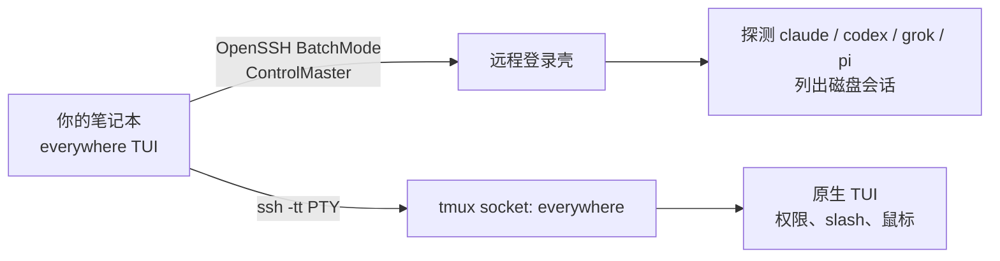

<p align="center">
  
</p>

<h1 align="center">everywhere</h1>

<p align="center"><a href="README.md">English</a> · <strong>中文</strong></p>

<p align="center">
  <strong>在家里的 Mac / Linux / WSL 上，从任何地方继续用你的 coding agent。</strong>
</p>

<p align="center">
  <a href="#快速开始">快速开始</a> ·
  <a href="docs/zh/README.md">文档中心</a> ·
  <a href="docs/zh/user-guide.md">用户手册</a> ·
  <a href="docs/zh/development.md">开发者文档</a>
</p>

<p align="center">
  
  
  
  
</p>

---

`everywhere` 是一个本机终端应用：读取你已有的 SSH Host，探测远程装了哪些 coding agent、有哪些会话，然后把终端 **透传** 给远程原生 TUI。

大模型、项目文件、MCP、API 密钥都留在远程。合上笔记本不会杀掉 agent——它在 tmux 里继续跑。之后再打开 `everywhere`，attach 同一个窗格即可。

## 为什么需要它

| 你现在已经在做的事 | 没有 everywhere | 有 everywhere |
| --- | --- | --- |
| `ssh devbox` 再自己记 `tmux attach` | 容易在同一仓库再拉起第二个 Codex/Claude | 主机 → agent → 会话，**live 只 attach** |
| Claude / ChatGPT / Grok 订阅在家里那台机器上 | 把密钥拷到咖啡馆笔记本很危险 | 密钥不离开远程 |
| 要原生 TUI（slash、鼠标、权限确认） | 官方桌面远程往往只服务一家 | Claude Code、Codex、Grok Build、Pi 同一个选择器 |

它不是新的 coding agent，不是云 IDE，也不是要在每台机器上安装的网关。

## 工作方式



1. 从 `~/.ssh/config` 选一个具体 `Host`（`*` 通配会被忽略）。
2. 用远程 **登录壳** 探测，这样 nvm / Homebrew / `~/.local/bin` 仍然有效。
3. 选择 agent 和会话，或在远程目录里新建。
4. 在独立 tmux socket `everywhere` 上创建或复用会话（不碰你日常的 tmux）。
5. 本机终端变成远程 agent。用 **`Ctrl-g d`** detach。以后再 attach；不要对 live 进程再 `resume`。

## 功能

- **四家 agent，一个选择器** — Claude Code、Codex、Grok Build、Pi；未安装显示 `not installed`，已安装显示版本。
- **原生 vibe coding** — 不是自研聊天界面。slash、diff、权限提示都是该 agent 自己的。
- **会话列表** — 磁盘上的 idle 记录，加上 **live** 的 tmux 窗格。
- **安全重连** — live 只 attach，避免两个 Codex 同时改同一仓库（[openai/codex#30424](https://github.com/openai/codex/issues/30424)）。
- **远程仍是你的** — 不在主机上装软件，不把 API key 拷到本机，不对外监听端口；流量走 SSH。
- **Doctor** — `everywhere doctor --host devbox` 打印 PATH、tmux 和各 agent 版本。

```
┌ everywhere · home-mac · Grok Build ──────────────────────────┐
│ sessions  [live]=tmux still running                          │
│ ▸ [live]  SSH passthrough TUI   (/Users/you/code/app)        │
│   [idle]  Fix flaky tests       (/Users/you/code/app)        │
│   [idle]  (no sessions — press n to start one)               │
├──────────────────────────────────────────────────────────────┤
│ enter attach/resume · n new · r refresh · q back             │
│ agent detach: C-g d                                          │
└──────────────────────────────────────────────────────────────┘
```

## 快速开始

**本机：** macOS 或 Linux，OpenSSH，对该 Host **密钥免密**（BatchMode，不能弹密码）。

**远程：** `sshd`、`tmux`、`python3`，以及至少一个已登录的 agent。Windows 主机：SSH 进 **WSL2**，不要走 Win32 OpenSSH。

```bash
git clone https://github.com/mahingbun-dev/everywhere-to-agent.git
cd everywhere-to-agent
cargo install --path .
```

```ssh-config
# ~/.ssh/config  — 选择器会忽略 Host * 这类通配
Host home-mac
    HostName 192.168.1.8
    User you
    IdentityFile ~/.ssh/id_ed25519
```

```bash
ssh home-mac true          # 必须免密成功
everywhere doctor --host home-mac
everywhere                 # TUI：主机 → agent → 会话
```

在 agent TUI 里用 **`Ctrl-g` 再按 `d`** detach。进程继续在远程跑。

完整步骤见 [用户手册](docs/zh/user-guide.md)。

## 文档

| 主题 | English | 中文 |
| --- | --- | --- |
| 文档中心 | [docs/](docs/README.md) | [docs/zh/](docs/zh/README.md) |
| 产品介绍 | [README](README.md) | [README.zh-CN.md](README.zh-CN.md) |
| 使用说明 | [User guide](docs/en/user-guide.md) | [用户手册](docs/zh/user-guide.md) |
| 架构与开发 | [Development](docs/en/development.md) | [开发者文档](docs/zh/development.md) |
| 参与贡献 | [Contributing](docs/en/contributing.md) | [参与贡献](docs/zh/contributing.md) |
| 安全 | [Security](docs/en/security.md) | [安全说明](docs/zh/security.md) |
| 后续计划 | [Roadmap](docs/en/roadmap.md) | [后续计划](docs/zh/roadmap.md) |

## 现状

v0.1 适合已经习惯 SSH 的人。接下来要做：**Windows 原生（不使用 WSL）**，以及 **App 前端样式**。详见 [后续开发计划](docs/zh/roadmap.md)。

当前计划之外：密码 SSH、ProxyJump、代装 tmux 或 agent。

## 许可证

[MIT](LICENSE)
