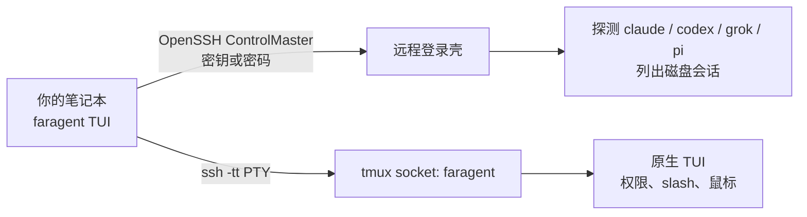

<p align="center">
  
</p>

<h1 align="center">FarAgent</h1>

<p align="center"><a href="README.md">English</a> · <strong>中文</strong></p>

<p align="center">
  <strong>远在你家机器上的 coding agent，用 SSH 接上原生 TUI。</strong><br>
  命令：<code>faragent</code>
</p>

<p align="center">
  <a href="#快速开始">快速开始</a> ·
  <a href="docs/zh/README.md">文档中心</a> ·
  <a href="docs/zh/user-guide.md">用户手册</a> ·
  <a href="docs/zh/development.md">开发者文档</a>
</p>

<p align="center">
  
  
  
  
</p>

---

**FarAgent**（命令 `faragent`）把你的终端接到 **已经装在自己机器上** 的 Claude Code、Codex、Grok Build、Pi。它不是 Herdr/ccmux 那种本地 mux，也不是把密钥隧道回本机：推理仍走远程配置。（曾用名 FarSSH。）

大模型、项目文件、MCP、API 密钥都留在远程。合上笔记本不会杀掉 agent——它在 tmux 里继续跑。之后再打开 `faragent`，attach 同一个窗格即可。

## 为什么需要它

| 你现在已经在做的事 | 没有 faragent | 有 faragent |
| --- | --- | --- |
| `ssh devbox` 再自己记 `tmux attach` | 容易在同一仓库再拉起第二个 Codex/Claude | 主机 → agent → 会话，**live 只 attach** |
| Claude / ChatGPT / Grok 订阅在家里那台机器上 | 把密钥拷到咖啡馆笔记本很危险 | 密钥不离开远程 |
| 要原生 TUI（slash、鼠标、权限确认） | 官方桌面远程往往只服务一家 | Claude Code、Codex、Grok Build、Pi 同一个选择器 |

它不是新的 coding agent，不是云 IDE，也不是要在每台机器上安装的网关。

## 工作方式



1. 从 `~/.ssh/config` 选一个具体 `Host`（`*` 通配会被忽略）。
2. 用远程 **登录壳** 探测，这样 nvm / Homebrew / `~/.local/bin` 仍然有效。
3. 选择 agent 和会话，或在远程目录里新建。
4. 在独立 tmux socket `faragent` 上创建或复用会话（不碰你日常的 tmux）。
5. 本机终端变成远程 agent。用 **`Ctrl-g d`** detach。以后再 attach；不要对 live 进程再 `resume`。

## 功能

- **四家 agent，一个选择器** — Claude Code、Codex、Grok Build、Pi；未安装显示「未安装 · 回车安装」。
- **原生 vibe coding** — 不是自研聊天界面。slash、diff、权限提示都是该 agent 自己的。
- **会话列表** — 磁盘上的 idle 记录，加上 **live** 的 tmux 窗格。
- **安全重连** — live 只 attach，避免两个 Codex 同时改同一仓库（[openai/codex#30424](https://github.com/openai/codex/issues/30424)）。
- **远程仍是你的** — 官方安装器在你确认命令之后跑在那台机器上；API key 留在远程；不对外监听；流量走 SSH。
- **安装 / 升级 / 卸载** — 确认屏列出每条命令，然后 `ssh -tt` 直播过程。agent：官方 `curl | bash`，用户目录，不用 sudo。tmux/curl 可用 sudo + brew/apt/dnf/yum/pacman/apk。
- **给方案，不让人猜** — 连不上时直接展示 **ssh 原始报错 + 原因 + 可复制命令**（报错页按 `y` 复制全文）。对照表见 [SSH 连接](docs/zh/ssh-access.md#连不上时原始报错--原因--解决)。
- **密钥或密码都行** — 默认密钥 / ssh-agent；服务端只让用账号密码时，交互式登录一次后复用多路复用连接。密码只交给系统 ssh，不落盘。
- **Doctor** — `faragent doctor --host devbox` 打印 PATH、tmux 和各 agent 版本。

```
┌ FarAgent · home-mac · Grok Build ──────────────────────────┐
│ sessions  [live]=tmux still running                          │
│ ▸ [live]  SSH passthrough TUI   (/Users/you/code/app)        │
│   [idle]  Fix flaky tests       (/Users/you/code/app)        │
│   [idle]  (no sessions — press n to start one)               │
├──────────────────────────────────────────────────────────────┤
│ enter attach/resume · n new · r refresh · q back             │
│ agent detach: C-g d                                          │
└──────────────────────────────────────────────────────────────┘
```

## 快速开始

**本机：** macOS / Linux / Windows 11，OpenSSH，以及一条能连上该 Host 的路 —— 密钥免密；或服务端只给密码时输一次（macOS/Linux 用 `faragent login`，Windows 由 TUI 在内存里记住本次运行的密码，见 [SSH 连接](docs/zh/ssh-access.md#windows-客户端说明)）。

**远程：** Linux/macOS（含 WSL2）要 `sshd` 和 `bash`；**原生 Windows 11** 要 Win32 OpenSSH 且保持默认的 cmd 外壳，推荐密钥登录。缺 tmux 或缺 agent 可从 TUI 代装（Windows 上用各家官方 PowerShell 安装器，没有 tmux）。请在那台机器上登录一次 agent。不需要 python3。

```bash
git clone https://github.com/mahingbun-dev/FarAgent.git
cd FarAgent
cargo install --path crates/faragent-cli
```

```ssh-config
# ~/.ssh/config  — 选择器会忽略 Host * 这类通配
# HostName：局域网 IP、公网 IP、域名，或 Tailscale 的 100.x / MagicDNS
Host home-mac
    HostName 192.168.1.8
    User you
    IdentityFile ~/.ssh/id_ed25519
```

```bash
ssh home-mac true          # 密钥这条路必须零交互成功（首次会问主机指纹）
faragent doctor --host home-mac
faragent                 # TUI：主机 → agent → 会话
```

Linux/macOS 远程：在 agent TUI 里用 **`Ctrl-g` 再按 `d`** detach，进程继续在远程跑。原生 Windows 远程：agent 在前台运行，退出（或断开连接）即结束，下次回车经 `resume` 恢复上下文。

只让用密码的机器：`faragent auth --host home-mac --mode password`，再 `faragent login --host home-mac`（或 TUI 主机列表按 `g` / 报错页按 `a`）。Windows 上由 TUI 自己弹出密码输入，仅保存在本次运行的进程内存里。

完整步骤见 [用户手册](docs/zh/user-guide.md)（开发者模式、打包二进制、迁到另一台电脑）。家里机器在 NAT 后面：见 [SSH 连接](docs/zh/ssh-access.md)（局域网、公网 IP、域名、Tailscale）。

## 文档

| 主题 | English | 中文 |
| --- | --- | --- |
| 文档中心 | [docs/](docs/README.md) | [docs/zh/](docs/zh/README.md) |
| 产品介绍 | [README](README.md) | [README.zh-CN.md](README.zh-CN.md) |
| 使用说明 | [User guide](docs/en/user-guide.md) | [用户手册](docs/zh/user-guide.md) |
| SSH（局域网 / 公网 / 域名 / Tailscale） | [SSH access](docs/en/ssh-access.md) | [SSH 连接](docs/zh/ssh-access.md) |
| 架构与开发 | [Development](docs/en/development.md) | [开发者文档](docs/zh/development.md) |
| 参与贡献 | [Contributing](docs/en/contributing.md) | [参与贡献](docs/zh/contributing.md) |
| 安全 | [Security](docs/en/security.md) | [安全说明](docs/zh/security.md) |
| 后续计划 | [Roadmap](docs/en/roadmap.md) | [后续计划](docs/zh/roadmap.md) |

## 现状

v0.2 新增 **Windows 11 原生支持（不使用 WSL）** —— 既能当客户端，也能当被连的远程主机（resume 模式）。接下来要做：**Windows 会话托管**（不用 WSL 的 tmux 等价保活）与 **App 前端样式**。详见 [后续开发计划](docs/zh/roadmap.md)。

密码 / 键盘交互登录已支持，见 [SSH 连接 · 服务端只让用密码](docs/zh/ssh-access.md#服务端只让用密码可选)。当前计划之外：OpenClaw 式网关、源码编译 tmux。

## 许可证

[MIT](LICENSE)
